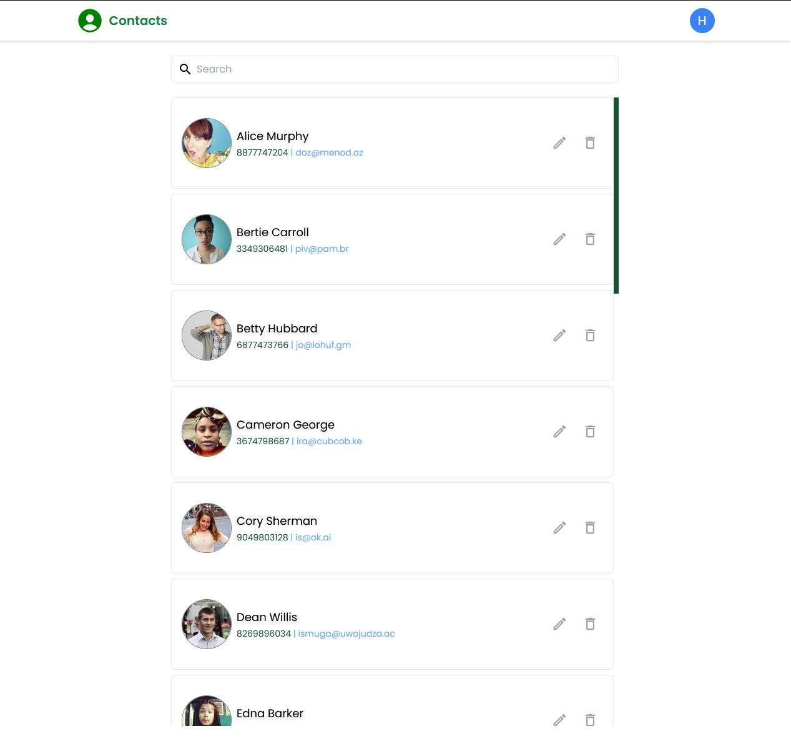

# Contacts App

A simple web-app use for managing contact.

## Features:

- [x] View list of contacts
- [x] Search a contact by name, phone number, email
- [x] View contact details
- [x] View user profile
- [x] Create / Edit / Delete a contact
- [x] Login / Logout / Register
- [ ] Dark - Light theme

## Tech stack and libraries:

- vue3
- vue-router
- pinia
- tailwindcss / sass
- firebase
- vee-validate

## Screenshot



## Customize configuration

See [Vite Configuration Reference](https://vitejs.dev/config/).

## Project Setup

```sh
pnpm install

```

### Compile and Hot-Reload for Development

```sh
yarn dev
```

### Type-Check, Compile and Minify for Production

```sh
yarn build
```

### Lint with [ESLint](https://eslint.org/)

```sh
yarn lint
```
